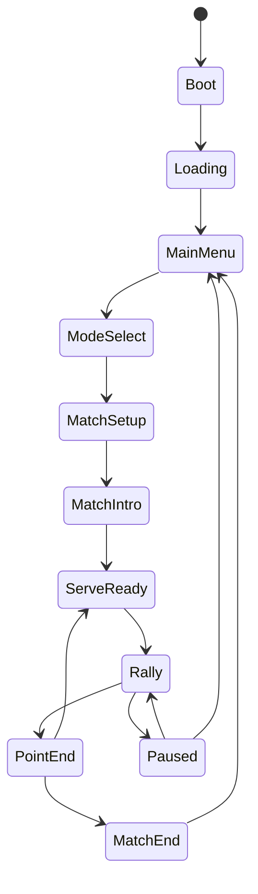
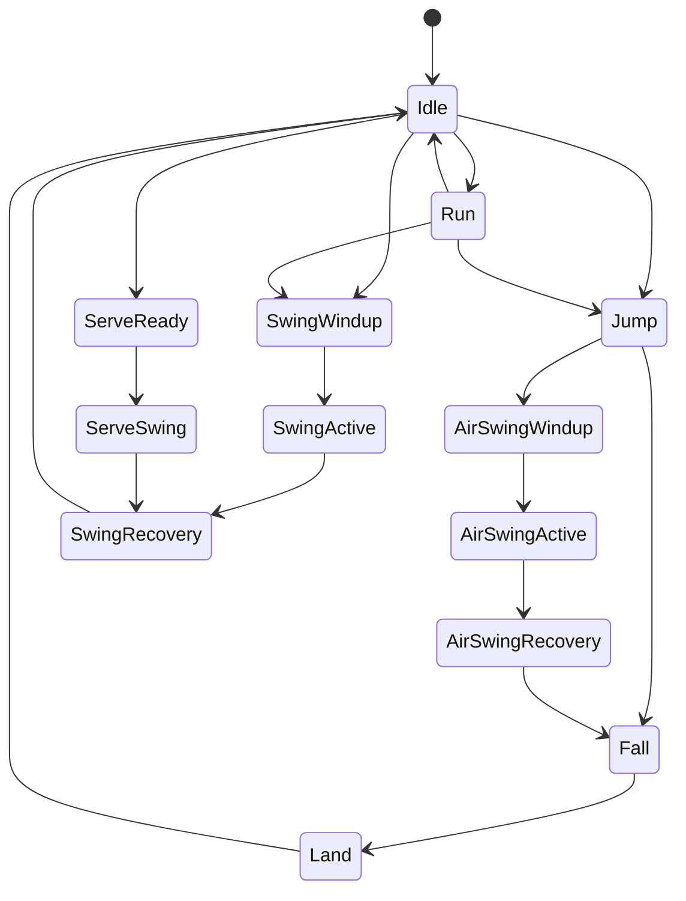
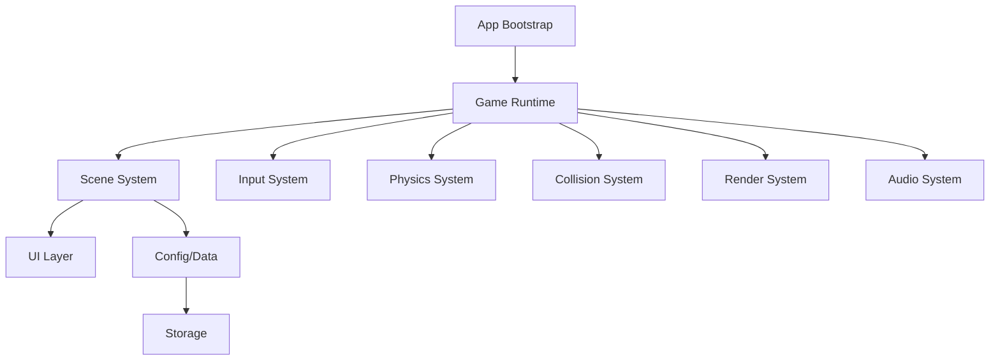
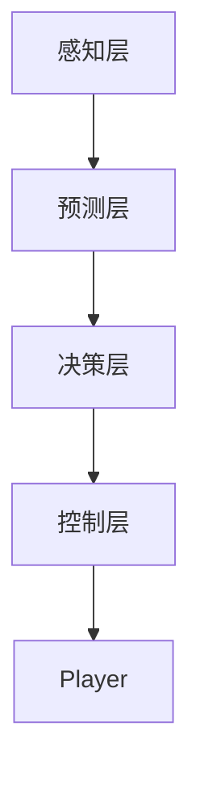
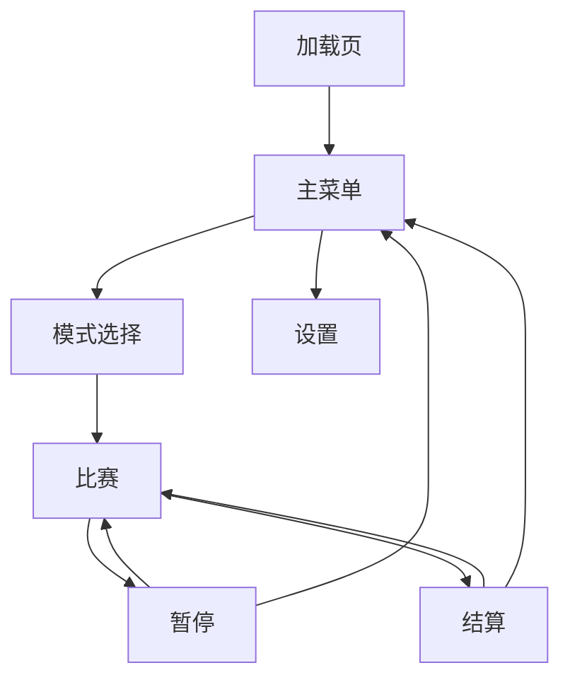

# H5《火柴人羽毛球》项目设计文档

> 文档定位：H5 2D 街机羽毛球游戏的产品、技术与工程设计说明。  
> 目标读者：具备较强前端、游戏开发或工程架构能力的开发者。  
> 实现范围：支持单人对战电脑、同屏双人 PK；不包含具体业务代码。  
> 版权建议：仅做玩法致敬，不直接复刻原 Flash 游戏名称、美术、音效、Logo、角色动作资源或关卡数据。

---

## 1. 项目概述

### 1.1 项目名称

暂定名：**Stick Badminton H5** / **火柴人羽毛球 H5**

正式发布时建议使用原创名称，例如：

- `Stick Shuttle Duel`
- `羽球火柴人竞技场`
- `Racket Duel H5`
- `Tiny Badminton Battle`

### 1.2 项目类型

一款基于浏览器运行的 2D 横版街机羽毛球游戏。

核心体验包括：

- 左右移动、跳跃、挥拍、扣杀、吊球、挑球。
- 羽毛球受重力、空气阻力、球拍挥速影响，呈现轻量但可信的飞行手感。
- 单人模式下玩家对战 AI。
- 双人模式下两名玩家共用键盘或外接手柄同屏 PK。
- 以短局、快节奏、低学习成本为设计导向。

### 1.3 目标平台

优先级从高到低：

| 平台 | 支持级别 | 说明 |
|---|---:|---|
| 桌面浏览器 | P0 | Chrome、Edge、Firefox、Safari，键盘操作优先 |
| 移动浏览器 | P1 | 横屏虚拟按键，适配触控 |
| PWA | P2 | 可安装、离线缓存、全屏启动 |
| 桌面壳 | P3 | 可用 Electron/Tauri 封装，非首发目标 |
| 在线多人 | P3/P4 | 不是本阶段核心，后续可扩展 |

### 1.4 核心卖点

- **童年 Flash 游戏质感**：火柴人、简洁场地、即时对抗。
- **手感优先**：击球反馈、球路变化、节奏感比视觉复杂度更重要。
- **低成本高可玩性**：少量实体、少量规则，靠物理和 AI 形成变化。
- **同屏双人**：保留本地 PK 的即时乐趣。
- **工程可扩展**：后续可加角色、球拍、技能、排行榜、回放、联网。

---

## 2. 项目目标与非目标

### 2.1 项目目标

#### P0 目标

- 实现稳定的 H5 游戏主循环。
- 实现完整的一局比赛流程。
- 实现角色移动、跳跃、挥拍。
- 实现羽毛球飞行、碰撞、落地判分。
- 实现单人对战电脑。
- 实现本地双人 PK。
- 实现基础菜单、暂停、重开、分数展示。
- 在主流桌面浏览器达到稳定 60 FPS。

#### P1 目标

- 增加 AI 难度分层。
- 增加多种击球类型：高远球、平抽、网前球、吊球、扣杀。
- 增加音效、简单粒子、击球震屏、慢动作等反馈。
- 增加移动端虚拟按键。
- 增加设置面板：音量、键位、难度、局分、画质。

#### P2 目标

- 增加角色外观和球拍皮肤。
- 增加训练模式。
- 增加本地数据存档。
- 增加 PWA 支持。
- 增加回放系统或精彩瞬间记录。

### 2.2 非目标

首版不追求：

- 写实羽毛球模拟器级别的精确物理。
- 标准羽毛球完整规则复刻。
- 在线实时多人对战。
- 复杂角色成长系统。
- 商业级美术表现。
- 高复杂骨骼动画系统。

本项目更适合做成 **街机羽毛球**，而不是 **专业体育模拟**。

---

## 3. 游戏玩法设计

### 3.1 核心循环

一局游戏的核心循环：

1. 进入比赛。
2. 发球方准备发球。
3. 双方移动、跳跃、挥拍。
4. 羽毛球在双方半场来回飞行。
5. 球触地、出界、触网或违规后判分。
6. 更新比分。
7. 判断是否结束比赛。
8. 未结束则进入下一回合。

单个回合的玩家体验重点：

- 判断球路。
- 移动到合适击球位置。
- 选择是否跳跃。
- 控制挥拍时机。
- 通过方向键和挥拍类型改变回球角度。
- 逼迫对手失误。

### 3.2 模式设计

#### 3.2.1 单人模式：玩家 vs 电脑

玩家控制左侧或右侧角色，另一侧由 AI 控制。

可配置项：

| 配置项 | 可选值 |
|---|---|
| 玩家站位 | 左场 / 右场 |
| AI 难度 | Easy / Normal / Hard / Expert |
| 比赛分制 | 5 分 / 7 分 / 11 分 / 15 分 / 21 分 |
| 胜利条件 | 先到指定分 / 两分差制可选 |
| 发球规则 | 得分方发球 / 固定轮换 / 街机简化 |

#### 3.2.2 双人模式：本地同屏 PK

两个玩家共用同一设备。

推荐默认键位：

| 玩家 | 左移 | 右移 | 跳跃 | 普通挥拍 | 强力挥拍 / 扣杀 |
|---|---|---|---|---|---|
| P1 | A | D | W | F | G |
| P2 | ← | → | ↑ | K | L |

可扩展支持：

- 键位自定义。
- 手柄映射。
- 移动端双虚拟摇杆 / 半屏按钮。
- 单键简化模式。

#### 3.2.3 训练模式

非首版必需，但建议保留架构入口。

训练内容：

- 无限发球机。
- 定点击球训练。
- 扣杀训练。
- 网前球训练。
- AI 不计分陪练。
- 轨迹显示和落点提示。

### 3.3 比赛规则

建议采用简化街机规则，降低实现复杂度和玩家理解成本。

#### 基础规则

- 球落在己方场地：对手得分。
- 球落在对方场地：己方得分。
- 球飞出左右边界：最后击球方失分。
- 球触网后可选择：
  - 简化规则：网视为实体，球碰网后反弹或落下。
  - 严格规则：发球触网或回球不过网则判负。
- 球从网下穿过：最后击球方失分。
- 角色不能越过中线。
- 角色可以跳跃击球，但不能进入对方半场。

#### 发球规则

推荐首版采用：**得分方发球**。

发球流程：

1. 判定发球方。
2. 球附着在发球方附近。
3. 玩家或 AI 进入发球准备状态。
4. 按挥拍键后进入发球动作。
5. 球脱离并进入飞行状态。
6. 回合开始。

可选简化：发球阶段只允许普通挥拍，不允许直接扣杀。

#### 计分规则

默认：**先到 N 分者胜**。

可选高级规则：

- 两分差胜利。
- 决胜分上限。
- 三局两胜。
- 街机限时模式。

---

## 4. 游戏状态机

### 4.1 全局状态

建议使用显式状态机管理全局流程。



### 4.2 Match 内部状态

| 状态 | 说明 |
|---|---|
| `MatchIntro` | 展示双方、规则、倒计时 |
| `ServeReady` | 发球准备，球附着发球方 |
| `Serving` | 发球动作进行中 |
| `Rally` | 正常对打 |
| `PointResolving` | 回合结束、判分、播放反馈 |
| `MatchEnd` | 比赛结束，显示胜负和统计 |

### 4.3 Player 状态



角色状态需要处理：

- 移动输入是否可响应。
- 是否允许转向。
- 是否允许二次挥拍。
- 当前动画帧是否处于有效击球窗口。
- 是否存在动作硬直。
- 是否处于空中。
- 是否正在发球。

---

## 5. 技术选型

### 5.1 推荐技术栈

| 层级 | 推荐方案 | 说明 |
|---|---|---|
| 语言 | TypeScript | 强类型、可维护、利于复杂状态建模 |
| 构建 | Vite | 开发快、配置轻、静态部署简单 |
| 渲染 | Canvas 2D / WebGL | 首版 Canvas 2D 足够；后期可迁移 WebGL |
| 游戏框架 | 自研轻量框架 / Phaser | 高水平开发者可自研；追求效率可用 Phaser |
| 状态管理 | 自研状态机 | 游戏状态不建议依赖传统前端状态库 |
| 音频 | Web Audio API | 低延迟、可做混音和音量控制 |
| 存储 | localStorage / IndexedDB | 设置、成绩、回放数据 |
| 测试 | Vitest / Playwright | 单元测试与端到端测试 |
| 代码质量 | ESLint / Prettier / TypeScript strict | 保证工程质量 |
| 部署 | 静态站点 | GitHub Pages、Vercel、Netlify、Nginx 均可 |

### 5.2 Canvas 2D 与游戏框架取舍

#### 自研 Canvas 2D

优点：

- 完全掌控主循环、物理、输入、渲染。
- 项目轻量，加载快。
- 更容易做出定制化手感。
- 适合完整理解游戏实现细节。

缺点：

- 资源管理、场景切换、动画、调试工具都要自行封装。
- 工程初期建设成本更高。

#### Phaser

优点：

- 场景、资源、精灵、输入、音频体系成熟。
- 原型速度快。
- 社区资料多。

缺点：

- 框架抽象会影响自定义物理与手感控制。
- 如果使用内置物理，可能需要绕过或深度改造。
- 对极简项目可能偏重。

#### 建议

如果目标是完整掌控并长期维护，推荐：

> **TypeScript + Vite + 自研轻量 2D Runtime + Canvas 2D**

如果目标是快速上线，推荐：

> **TypeScript + Vite + Phaser**

---

## 6. 工程架构

### 6.1 总体架构



### 6.2 核心模块

| 模块 | 责任 |
|---|---|
| `Runtime` | 游戏启动、主循环、生命周期、时间步进 |
| `SceneManager` | 菜单、加载、比赛、结算等场景切换 |
| `InputSystem` | 键盘、触控、手柄、输入缓冲、键位映射 |
| `PhysicsSystem` | 角色运动、羽毛球飞行、重力、阻力、边界处理 |
| `CollisionSystem` | 球拍、球、地面、球网、场地边界碰撞 |
| `AISystem` | 单人模式下电脑行为决策 |
| `RuleSystem` | 发球、得分、胜负、出界判定 |
| `RenderSystem` | Canvas 绘制、层级、相机、缩放、特效 |
| `AnimationSystem` | 火柴人姿态、挥拍帧、动作过渡 |
| `AudioSystem` | 音效播放、混音、音量、静音 |
| `ConfigSystem` | 平衡参数、难度参数、键位配置 |
| `StorageSystem` | 本地设置、成绩、回放、统计数据 |
| `DebugSystem` | Hitbox、轨迹、AI 意图、性能监控 |

### 6.3 推荐目录结构

```text
src/
  app/
    bootstrap
    runtime
    lifecycle

  core/
    time
    math
    event-bus
    state-machine
    object-pool
    random

  game/
    scenes/
      boot
      loading
      main-menu
      mode-select
      match
      result

    entities/
      player
      shuttlecock
      racket
      net
      court

    components/
      transform
      velocity
      collider
      animation
      controller

    systems/
      input
      physics
      collision
      rules
      ai
      animation
      rendering
      audio
      effects
      camera
      ui

    modes/
      single-player
      local-versus
      training

    config/
      court
      physics
      player
      racket
      ai
      match
      controls
      audio

  assets/
    images
    audio
    fonts
    atlases

  platform/
    browser
    storage
    fullscreen
    pwa

  tools/
    debug-panel
    trajectory-visualizer
    hitbox-viewer
```

说明：以上是逻辑目录，实际文件命名可按团队规范调整。

### 6.4 架构风格

可选两种主流风格。

#### OOP + System

适合本项目首版。

- `Player`、`Shuttlecock`、`Racket` 是领域对象。
- `PhysicsSystem`、`CollisionSystem`、`AISystem` 处理跨实体逻辑。
- 对象内维护局部状态，系统处理全局规则。

优点：直观、开发快、认知成本低。

#### ECS

适合后续复杂扩展。

- Entity 只持有 ID。
- Component 存储数据。
- System 处理逻辑。

优点：扩展性、批处理、调试能力强。  
缺点：首版可能过度设计。

建议：

> 首版采用 **OOP + System**，保留向 ECS 迁移的边界。

---

## 7. 坐标系与场地设计

### 7.1 世界坐标

建议使用逻辑世界坐标，而不是直接使用屏幕像素。

例如：

| 项 | 建议 |
|---|---|
| 世界宽度 | 1600 单位 |
| 世界高度 | 900 单位 |
| 地面 Y | 780 单位 |
| 球网 X | 800 单位 |
| 球网高度 | 220 单位 |
| 左右半场宽度 | 800 单位 |
| 角色身高 | 170 单位 |

渲染阶段根据屏幕尺寸进行等比缩放。

### 7.2 相机与适配

推荐使用固定逻辑画布：

- 设计分辨率：`16:9`。
- 横屏优先。
- 保持完整场地可见。
- 使用 letterbox/pillarbox 处理不同屏幕比例。
- UI 使用屏幕空间布局，游戏实体使用世界空间布局。

### 7.3 场地碰撞区域

核心区域：

| 区域 | 用途 |
|---|---|
| 左半场地面 | 判断右方得分 |
| 右半场地面 | 判断左方得分 |
| 左右边界 | 判断出界 |
| 球网矩形 / 胶囊体 | 判断触网 |
| 中线屏障 | 限制角色越界 |
| 上边界 | 可选，通常不强制碰撞 |

---

## 8. 实体设计

### 8.1 Player

玩家实体负责表达角色的当前状态，不直接承担全部行为逻辑。

核心属性：

| 属性 | 说明 |
|---|---|
| `side` | 左场 / 右场 |
| `position` | 世界坐标 |
| `velocity` | 当前速度 |
| `facing` | 朝向 |
| `state` | 当前动作状态 |
| `grounded` | 是否在地面 |
| `stamina` | 可选，体力或蓄力资源 |
| `swingCooldown` | 挥拍冷却 |
| `racketAnchor` | 球拍挂点 |
| `controller` | 输入来源：人类 / AI |
| `stats` | 速度、跳跃、力量、反应等参数 |

角色能力参数：

| 参数 | 影响 |
|---|---|
| 移动速度 | 接球覆盖范围 |
| 加速度 | 启动手感 |
| 地面摩擦 | 停止手感 |
| 跳跃速度 | 高点击球能力 |
| 空中控制 | 跳起后的横向修正 |
| 挥拍速度 | 出球速度加成 |
| 挥拍范围 | 容错率 |
| 恢复时间 | 失误惩罚 |

### 8.2 Racket

球拍可以作为 Player 的子实体或派生碰撞结构。

建议不要只用一个圆形 hitbox，而使用：

- 拍面胶囊体。
- 手柄线段。
- 有效击球扇区。
- 挥拍速度向量。

球拍状态：

| 状态 | 说明 |
|---|---|
| Idle | 非挥拍状态，不产生有效击球 |
| Windup | 起手阶段，允许预输入但不击球 |
| Active | 有效击球帧 |
| Recovery | 收拍硬直 |

球拍的关键是 **Active Window**，也就是只有部分帧可以击中球。这样可以强化时机感。

### 8.3 Shuttlecock

羽毛球是游戏手感核心。

核心属性：

| 属性 | 说明 |
|---|---|
| `position` | 世界坐标 |
| `velocity` | 当前速度 |
| `acceleration` | 当前加速度 |
| `radius` | 碰撞半径 |
| `orientation` | 朝向，通常跟随速度方向 |
| `lastTouchedBy` | 最后击球方 |
| `state` | 发球附着 / 飞行 / 落地 / 出界 |
| `spin` | 可选，用于表现和细微轨迹变化 |
| `trail` | 可选，轨迹残影 |

羽毛球状态：

| 状态 | 说明 |
|---|---|
| AttachedToServer | 发球准备，跟随发球角色 |
| Served | 发球瞬间 |
| Flying | 正常飞行 |
| NetHit | 触网反馈 |
| Grounded | 落地，等待判分 |
| Out | 出界 |
| Resetting | 回合重置 |

### 8.4 Court

场地对象包含静态几何与规则区域。

内容包括：

- 地面线。
- 球网。
- 左右场地区域。
- 出界区域。
- 发球点。
- 摄像机边界。
- UI 锚点。

### 8.5 Match

Match 是比赛上下文。

核心数据：

| 数据 | 说明 |
|---|---|
| `mode` | 单人 / 双人 / 训练 |
| `score` | 当前比分 |
| `round` | 当前回合数 |
| `serverSide` | 当前发球方 |
| `winner` | 比赛胜者 |
| `ruleset` | 规则配置 |
| `stats` | 统计信息 |
| `seed` | 可选，确定性随机种子 |

统计信息建议记录：

- 回合次数。
- 最长回合拍数。
- 每方击球次数。
- 扣杀次数。
- 失误次数。
- 平均回球速度。
- AI 误差参数。

---

## 9. 游戏循环与时间步进

### 9.1 主循环职责

每帧顺序：

1. 采样输入。
2. 计算帧时间。
3. 固定步进更新游戏逻辑。
4. 处理碰撞和规则。
5. 更新动画和特效。
6. 渲染当前帧。
7. 输出调试数据。

### 9.2 固定时间步

建议逻辑更新采用固定时间步。

推荐：

- 物理更新：`1/120s` 或 `1/60s`。
- 渲染：跟随浏览器刷新率。
- 使用 accumulator 消化帧间隔。
- 设置最大追帧次数，避免切后台后长时间补帧。

原因：

- 物理稳定。
- AI 预测稳定。
- 回放和调试更容易。
- 未来做联网更有基础。

### 9.3 时间缩放

建议 Runtime 支持：

- 暂停。
- 慢动作。
- 击球瞬间短暂停顿。
- 结算时冻结。
- Debug 单步推进。

这些功能对手感调试非常重要。

---

## 10. 输入系统

### 10.1 输入抽象

不要让游戏逻辑直接读取键盘事件。

推荐抽象为：

| 层 | 说明 |
|---|---|
| Device Input | 键盘、触摸、手柄原始事件 |
| Action Mapping | 将按键映射为 MoveLeft、Jump、Swing 等动作 |
| Input Snapshot | 每个逻辑帧读取一次当前动作状态 |
| Command Buffer | 保存短时间输入缓冲 |
| Controller | HumanController / AIController 统一输出意图 |

这样 Human 和 AI 可以共享同一套 Player 控制入口。

### 10.2 输入动作

基础动作：

| 动作 | 说明 |
|---|---|
| MoveLeft | 向左移动 |
| MoveRight | 向右移动 |
| Jump | 跳跃 |
| Swing | 普通挥拍 |
| PowerSwing | 强力挥拍 / 扣杀 |
| DropShot | 可选，吊球或轻拍 |
| Pause | 暂停 |
| Confirm | 菜单确认 |
| Back | 菜单返回 |

### 10.3 输入缓冲

建议支持：

- 跳跃缓冲：按早一点也能跳。
- 挥拍缓冲：球即将进范围时提前按键不会完全丢失。
- Coyote Time：离地极短时间内仍可跳，增强手感。
- 同帧动作优先级：例如挥拍优先于移动转向。

### 10.4 键盘冲突问题

双人同键盘会遇到键盘矩阵冲突。建议：

- 默认键位避开高冲突组合。
- 提供键位检测工具。
- 提供键位重映射。
- 支持手柄作为 P2 输入。
- 支持移动端触屏分区。

---

## 11. 物理系统设计

### 11.1 设计原则

本项目物理目标不是完全真实，而是 **可控、可预测、可调优、爽快**。

优先级：

1. 玩家能理解球为什么这样飞。
2. 球路足够丰富。
3. 扣杀、吊球、高远球有明显区别。
4. AI 能预测并参与对抗。
5. 数值容易调参。

### 11.2 角色运动

角色运动模型：

- 水平方向：加速度驱动，最大速度限制。
- 地面：摩擦或阻尼较强，停止利落。
- 空中：横向控制减弱。
- 跳跃：固定初速度，可选长按影响小幅高度。
- 边界：角色不能跨过中线和外侧边界。

关键手感参数：

| 参数 | 作用 |
|---|---|
| 最大横向速度 | 决定覆盖面积 |
| 横向加速度 | 决定启动灵敏度 |
| 地面阻尼 | 决定刹车手感 |
| 空中控制系数 | 决定跳跃中可修正程度 |
| 跳跃初速度 | 决定可击球高度 |
| 重力 | 决定起落速度 |
| 落地硬直 | 防止无脑跳跃 |

### 11.3 羽毛球飞行

羽毛球建议采用简化空气动力模型。

基础力：

- 重力：持续向下。
- 线性阻尼：用于快速稳定速度。
- 二次阻力：速度越大衰减越强，符合羽毛球高速后明显减速的感觉。
- 可选升力：用于高远球或特殊球路。

推荐表现：

- 扣杀初速快，但衰减也快。
- 高远球初速较高，垂直分量更大，落点深。
- 吊球初速小，接近网前快速下落。
- 平抽球高度低，水平速度稳定但不宜太快。

### 11.4 羽毛球朝向

视觉上羽毛球头部应大致朝向速度方向。

建议：

- 速度较大时朝向完全跟随速度。
- 速度较小时使用平滑插值，避免抖动。
- 触网、落地、扣杀时可加入旋转扰动。

### 11.5 世界边界

| 边界 | 行为 |
|---|---|
| 地面 | 球触地后立即判分，不建议反弹继续比赛 |
| 左右出界 | 若球越过边界且无落地，判出界 |
| 上边界 | 通常不碰撞；过高时可限制或仍允许 |
| 球网 | 可碰撞、弹回、挂网或判不过网 |

---

## 12. 击球模型

### 12.1 击球体验目标

击球是项目成败关键。

需要满足：

- 玩家能感受到“早挥”“正点”“晚挥”的区别。
- 不同高度、距离、方向会影响球路。
- 跳起击球和地面击球有明显差异。
- 强力挥拍能形成压迫，但有硬直和失误风险。
- 网前轻拍、高远球、扣杀能通过输入组合触发。

### 12.2 球拍有效区

建议将球拍有效区建模为：

- 拍面线段。
- 拍面半径形成的胶囊体。
- 前方有效扇形。
- Active 帧窗口。

命中条件可由以下因素共同决定：

- 球心到拍面线段距离。
- 球是否在角色正面半空间。
- 球是否处于挥拍 Active 时间窗口。
- 球和球拍相对速度是否合理。
- 同一次挥拍是否已经击中过球。

### 12.3 出球速度计算

出球速度由多部分组成：

| 来源 | 说明 |
|---|---|
| 基础球路速度 | 不同击球类型的基准速度 |
| 球拍挥速 | 挥拍动作带来的速度增量 |
| 角色速度 | 前冲、后退、跳跃对球路有轻微影响 |
| 输入方向 | 上、下、前、后控制球路倾向 |
| 命中时机 | 正点命中获得最佳速度与角度 |
| 命中部位 | 拍面中心更稳定，边缘更容易失误 |
| 难度/角色属性 | 可选，影响力量和容错 |

### 12.4 击球类型

建议定义以下球路：

| 类型 | 触发方式 | 表现 | 用途 |
|---|---|---|---|
| Clear 高远球 | 上 + 普通挥拍 | 高弧线，落点靠后 | 拉开对手 |
| Drive 平抽球 | 前 + 普通挥拍 | 低平快速 | 压迫中场 |
| Drop 吊球 | 下 / 轻拍 | 低速过网，快速下坠 | 调动对手上网 |
| Lift 挑球 | 防守位 + 上 | 从低点挑高 | 解围 |
| Smash 扣杀 | 空中 + 强力挥拍 + 球高于网 | 快速下压 | 主动得分 |
| Net Shot 网前球 | 近网 + 轻拍 | 贴网短球 | 逼迫失误 |
| Lob 过顶球 | 后 + 上 | 高远过顶 | 反制前压 |

### 12.5 时机判定

挥拍命中质量可分为：

| 命中质量 | 判定 | 结果 |
|---|---|---|
| Perfect | 球在拍面中心且时间点最佳 | 速度和角度最优 |
| Good | 正常命中 | 标准回球 |
| Late | 晚挥 | 球路偏高或偏短 |
| Early | 早挥 | 力量不足或漏球 |
| Edge | 拍边命中 | 偏转、减速、随机误差 |
| Miss | 未命中 | 进入收拍硬直 |

### 12.6 击球冷却与连击限制

建议：

- 同一挥拍动作只能命中一次。
- 同一方不能在极短时间内连续多次击中球，除非规则允许救球。
- 扣杀后恢复时间长于普通挥拍。
- 空中挥拍后落地可附加短硬直。
- 强力挥拍失败应产生惩罚，否则玩家会无脑连按。

---

## 13. 碰撞系统

### 13.1 碰撞对象

| 对象 A | 对象 B | 结果 |
|---|---|---|
| 羽毛球 | 球拍 | 计算出球速度 |
| 羽毛球 | 球网 | 反弹、下坠或判负 |
| 羽毛球 | 地面 | 回合结束并判分 |
| 羽毛球 | 左右边界 | 出界判定 |
| 玩家 | 地面 | 落地 |
| 玩家 | 中线/外侧边界 | 限制移动 |

### 13.2 碰撞顺序

建议每个固定更新帧：

1. 预测实体新位置。
2. 处理玩家与场地边界。
3. 处理羽毛球与球拍。
4. 处理羽毛球与球网。
5. 处理羽毛球与地面/边界。
6. 触发规则系统事件。

### 13.3 连续碰撞检测

羽毛球在扣杀时速度较快，离散碰撞可能穿透球拍或球网。

建议对羽毛球使用 swept collision：

- 使用上一帧位置到当前帧位置形成运动线段。
- 与球拍胶囊体、球网矩形进行连续检测。
- 命中后回退到碰撞点附近再结算速度。

### 13.4 Hitbox 调试

调试模式必须具备：

- 显示球拍有效区。
- 显示羽毛球碰撞圆。
- 显示球网碰撞体。
- 显示预测轨迹。
- 显示当前命中质量。
- 显示 AI 目标点。
- 显示每帧碰撞事件。

---

## 14. AI 设计

### 14.1 AI 目标

AI 不是追求最优，而是追求 **像人、可战胜、有难度曲线**。

好的 AI 应该：

- 能稳定接基本球。
- 会根据落点移动。
- 会选择合适击球类型。
- 会犯错。
- 高难度时更聪明，而不是单纯数值作弊。
- 不应提前读取玩家未来输入。

### 14.2 AI 架构

推荐使用三层：



#### 感知层

AI 可读取：

- 羽毛球位置、速度、朝向。
- 自己位置、速度、状态。
- 对手位置、速度、状态。
- 分数、发球方、当前回合阶段。
- 球是否已越网。
- 球预测落点。

#### 预测层

预测内容：

- 球是否会到达己方半场。
- 球越网高度。
- 球落点。
- 可击球时间窗口。
- 理想击球位置。
- 是否需要跳跃。

预测可以采用：

- 轻量数值模拟。
- 简化解析估计。
- 多采样路径缓存。

建议直接复用游戏物理参数做短时间前向模拟，以减少预测和实际表现不一致。

#### 决策层

决策目标：

- 接球。
- 回中。
- 前压。
- 防守。
- 扣杀。
- 吊球。
- 高远球。
- 发球。

推荐策略：**有限状态机 + Utility Score**。

状态机负责大方向：

| 状态 | 行为 |
|---|---|
| Idle | 等待或轻微站位调整 |
| TrackBall | 追踪球路 |
| MoveToIntercept | 移动到预计击球点 |
| PrepareSwing | 准备挥拍 |
| Swing | 执行击球 |
| Recover | 回中或防守 |
| Serve | 发球 |

Utility Score 负责球路选择：

| 因素 | 影响 |
|---|---|
| 球高度 | 高球更适合扣杀或高远 |
| 球离网距离 | 近网适合网前球或挑球 |
| 对手站位 | 对手靠前则打后场，对手靠后则吊网前 |
| 自身状态 | 失位时优先防守球 |
| 当前比分 | 关键分降低冒险概率 |
| 难度等级 | 影响球路选择质量 |
| 随机性 | 避免机械重复 |

#### 控制层

AI 最终输出与人类玩家相同的控制意图：

- 左移 / 右移。
- 跳跃。
- 普通挥拍。
- 强力挥拍。
- 方向修饰。

这样可以避免 AI 直接操作物理状态，保持公平和架构统一。

### 14.3 AI 难度参数

| 参数 | Easy | Normal | Hard | Expert |
|---|---:|---:|---:|---:|
| 反应延迟 | 高 | 中 | 低 | 很低 |
| 轨迹预测误差 | 高 | 中 | 低 | 极低 |
| 移动速度倍率 | 低 | 标准 | 略高 | 高 |
| 击球时机误差 | 高 | 中 | 低 | 极低 |
| 球路选择 | 简单 | 基础策略 | 针对站位 | 高级策略 |
| 主动进攻率 | 低 | 中 | 高 | 高 |
| 非受迫失误率 | 高 | 中 | 低 | 很低 |
| 假动作/变化 | 无 | 少 | 中 | 多 |

注意：Expert 可以更强，但仍应保留微小失误概率，否则体验会变成机械压制。

### 14.4 AI 失误设计

AI 失误不是随机送分，而应看起来合理。

失误来源：

- 启动慢导致够不到球。
- 预测落点偏差导致站位错误。
- 早挥或晚挥。
- 高难度球路下回球质量下降。
- 连续被调动后恢复不及时。
- 扣杀失败挂网或出界。

---

## 15. 双人 PK 设计

### 15.1 本地双人

本地双人模式应尽量公平：

- 双方使用相同角色参数。
- 相同球拍范围。
- 相同动作硬直。
- 相同输入缓冲。
- 双方半场镜像。

### 15.2 输入隔离

每名玩家绑定一个 Controller。

| Controller | 输入源 |
|---|---|
| P1HumanController | 键盘 A/D/W/F/G |
| P2HumanController | 方向键/K/L |
| AIController | 决策系统 |
| TouchController | 虚拟按钮 |
| GamepadController | 手柄 |

比赛模式只决定 Controller 组合：

| 模式 | 左侧 | 右侧 |
|---|---|---|
| 单人左场 | Human | AI |
| 单人右场 | AI | Human |
| 双人 PK | Human P1 | Human P2 |
| AI 观战 | AI | AI |
| 训练 | Human | Dummy / AI |

### 15.3 未来在线多人预留

虽然首版不做在线，但架构上可以预留：

- 固定时间步。
- 输入命令序列化。
- 确定性随机种子。
- 游戏状态快照。
- 回放日志。
- 权威服务器或 P2P 同步策略。

在线多人可选路线：

| 方案 | 优点 | 缺点 |
|---|---|---|
| Lockstep | 带宽低，回放容易 | 对延迟敏感，需确定性 |
| Rollback | 格斗游戏体验好 | 实现复杂，状态回滚成本高 |
| Server Authority | 反作弊好 | 服务器成本高，延迟补偿复杂 |

---

## 16. 渲染系统

### 16.1 渲染目标

视觉目标：

- 简洁清晰。
- 动作可读性强。
- 球和球拍轨迹清楚。
- 击球反馈明显。
- 不依赖复杂素材也能有表现力。

### 16.2 渲染分层

推荐顺序：

1. 背景墙面 / 天空。
2. 地板 / 场地线。
3. 远景装饰。
4. 玩家阴影。
5. 玩家身体。
6. 球拍。
7. 羽毛球轨迹。
8. 羽毛球。
9. 球网。
10. 击球特效。
11. UI。
12. Debug overlay。

球网可以在玩家和球之间按表现需要调整层级：

- 网柱和网线通常在球前。
- 人物可被网部分遮挡。
- 羽毛球过网时可强调前后关系。

### 16.3 火柴人表现方案

#### 方案 A：程序绘制

使用线段、圆形、关节点绘制火柴人。

优点：

- 无需素材。
- 易于做骨骼姿态插值。
- 适合复古 Flash 风格。
- 文件体积小。

缺点：

- 需要自己设计动作姿态。
- 复杂表现有限。

#### 方案 B：Sprite Atlas

使用帧动画素材。

优点：

- 视觉更稳定。
- 动画师可参与。
- 美术表现更丰富。

缺点：

- 素材量增加。
- 动作扩展成本高。
- 不如骨骼动画灵活。

#### 建议

首版使用 **程序火柴人 + 姿态关键帧**。

### 16.4 动作可读性

必须保证：

- 挥拍 Active 帧视觉上明显。
- 扣杀动作和普通挥拍可区分。
- 起跳、下落、落地反馈清楚。
- AI 也遵守相同动作可视化，不能瞬间出手。

### 16.5 特效

建议添加但保持克制：

| 特效 | 触发 |
|---|---|
| 球尾迹 | 高速飞行 |
| 击球闪光 | Perfect / Smash |
| 屏幕震动 | 扣杀、关键分 |
| 地面尘土 | 起跳、落地、急停 |
| 网震动 | 触网 |
| 慢动作 | 绝杀或极限救球 |
| 分数弹字 | 得分时 |

---

## 17. 动画系统

### 17.1 动画表示

程序火柴人可以用姿态 Pose 表示。

一个 Pose 包含：

- 头部位置。
- 躯干角度。
- 左右上臂角度。
- 左右前臂角度。
- 左右大腿角度。
- 左右小腿角度。
- 球拍手挂点。
- 球拍角度。

### 17.2 动画时间线

挥拍动作建议拆成：

| 阶段 | 说明 |
|---|---|
| Windup | 起手蓄势 |
| ActiveStart | 有效击球开始 |
| ActivePeak | 最佳命中点 |
| ActiveEnd | 有效击球结束 |
| Recovery | 收拍恢复 |

动作时间必须和碰撞窗口绑定，不能只做视觉动画。

### 17.3 动画混合

需要处理：

- 站立到跑动。
- 跑动到跳跃。
- 空中挥拍。
- 落地恢复。
- 转身挥拍。
- 发球动作。

简单实现可使用硬切 + 少量插值。后续可使用动画状态机和 blend tree。

---

## 18. 音频系统

### 18.1 音频事件

| 事件 | 音效 |
|---|---|
| 普通击球 | 清脆击球声 |
| 强力扣杀 | 更重的击球声 |
| 球触网 | 网绳声 |
| 球落地 | 轻微落地声 |
| 跳跃 | 脚步/弹跳声 |
| 落地 | 脚步声 |
| 得分 | 分数提示声 |
| 菜单选择 | UI 声 |
| 胜利 | 结算音效 |

### 18.2 音频设计原则

- 击球声延迟必须低。
- 同类音效需要做音量和音高轻微随机，避免重复疲劳。
- 扣杀声和普通挥拍声要有明显差异。
- 音乐可选，不应遮挡击球反馈。
- 提供总音量、音乐音量、音效音量、静音设置。

---

## 19. UI / UX 设计

### 19.1 页面流程



### 19.2 主菜单

菜单项：

- 单人对战。
- 双人 PK。
- 训练模式。
- 设置。
- 操作说明。
- 关于。

### 19.3 比赛 UI

应展示：

- 左右比分。
- 当前发球方。
- 局点 / 赛点提示。
- 倒计时或 Ready/Go。
- 暂停按钮。
- 当前模式。

可选展示：

- 回合拍数。
- 扣杀速度。
- Perfect 命中提示。
- AI 难度。

### 19.4 设置项

| 分类 | 设置 |
|---|---|
| 游戏 | 分制、难度、发球规则、镜像站位 |
| 控制 | 键位映射、手柄检测、触控布局 |
| 音频 | 总音量、音乐、音效、静音 |
| 画面 | 粒子、轨迹、震屏、帧率显示 |
| 辅助 | 轨迹提示、落点提示、简化操作 |

### 19.5 暂停菜单

- 继续。
- 重新开始。
- 设置。
- 操作说明。
- 返回主菜单。

---

## 20. 数据驱动与配置设计

### 20.1 配置原则

所有影响手感和平衡的参数必须数据化。

不要将以下内容硬编码在逻辑里：

- 重力。
- 阻力。
- 角色速度。
- 跳跃高度。
- 球拍范围。
- 挥拍时间。
- 球路速度。
- AI 误差。
- 得分规则。
- 键位。

### 20.2 配置分类

| 配置 | 内容 |
|---|---|
| CourtConfig | 场地尺寸、地面高度、球网位置、边界 |
| PlayerConfig | 移动、跳跃、硬直、属性 |
| RacketConfig | 拍面长度、有效半径、动作时间、冷却 |
| ShuttleConfig | 质量、重力、阻力、速度上限、碰撞半径 |
| ShotConfig | 高远球、吊球、扣杀等球路参数 |
| AIConfig | 难度、反应、误差、策略权重 |
| MatchConfig | 分制、发球规则、胜利条件 |
| InputConfig | 默认键位、手柄映射、触控布局 |
| AudioConfig | 音量、音效资源、随机音高范围 |
| VFXConfig | 粒子、震屏、慢动作、尾迹 |

### 20.3 调参面板

建议开发期做 Debug Tuning Panel：

- 实时修改物理参数。
- 实时修改 AI 参数。
- 保存当前参数快照。
- 对比不同版本手感。
- 显示轨迹预测。
- 显示命中质量。

手感类游戏没有调参工具会严重拖慢开发效率。

---

## 21. 资源管理

### 21.1 资源类型

| 类型 | 示例 |
|---|---|
| 图片 | 背景、UI、图标、粒子 |
| 音频 | 击球、落地、菜单、得分 |
| 字体 | 像素字体或手写字体 |
| 数据 | 配置、动作时间线、关卡参数 |
| 图集 | 可选，Sprite Atlas |

### 21.2 加载策略

- Boot 阶段加载最小启动资源。
- Loading 阶段加载比赛核心资源。
- 非关键资源延迟加载。
- 加载失败提供 fallback。
- 音频需要处理浏览器自动播放策略，首次用户交互后解锁。

### 21.3 版权与原创性

必须避免：

- 直接截取原游戏素材。
- 直接使用原游戏音效。
- 直接使用原游戏标题和 Logo。
- 直接照搬关卡、数值、角色名称。

建议：

- 自绘火柴人。
- 自制音效或使用明确授权素材。
- 使用原创 UI 和名称。
- 只保留“火柴人羽毛球对战”这个通用玩法方向。

---

## 22. 存档与本地数据

### 22.1 需要保存的数据

| 数据 | 存储建议 |
|---|---|
| 设置 | localStorage |
| 键位映射 | localStorage |
| 历史胜负 | localStorage / IndexedDB |
| 最高分 / 最长回合 | localStorage |
| 回放数据 | IndexedDB |
| 调参快照 | 开发环境 localStorage 或文件导出 |

### 22.2 数据版本

存档需要包含版本号。

原因：

- 后续配置结构会变化。
- 旧存档需要迁移或清理。
- 防止字段缺失导致运行错误。

### 22.3 回放设计预留

如果未来做回放，建议保存：

- 初始随机种子。
- 初始比赛配置。
- 每个固定帧的输入命令。
- 关键事件校验点。

不要保存每帧完整世界状态，除非用于 Debug 或精彩片段。

---

## 23. 调试工具设计

### 23.1 Debug Overlay

应支持显示：

- FPS。
- Frame time。
- 固定更新时间。
- 实体数量。
- 碰撞次数。
- 当前游戏状态。
- 当前 Player 状态。
- 球速度、角度、高度。
- 当前击球质量。
- AI 当前决策。

### 23.2 可视化工具

| 工具 | 用途 |
|---|---|
| Hitbox Viewer | 显示角色、球拍、球网、羽毛球碰撞体 |
| Trajectory Viewer | 显示羽毛球预测轨迹 |
| AI Intent Viewer | 显示 AI 目标点、预测落点、状态 |
| Input Viewer | 显示当前按键和输入缓冲 |
| Event Log | 显示击球、触网、落地、得分事件 |
| Tuning Panel | 实时调整参数 |

### 23.3 Debug 快捷操作

建议支持：

- 重置回合。
- 强制发球。
- 切换 AI 控制。
- 开关慢动作。
- 单帧步进。
- 传送球到指定位置。
- 固定球速测试。
- 显示/隐藏 UI。
- 录制输入序列。

---

## 24. 性能设计

### 24.1 目标指标

| 指标 | 目标 |
|---|---:|
| 桌面浏览器帧率 | 稳定 60 FPS |
| 高刷新率屏幕 | 逻辑稳定，渲染可跟随 |
| 首屏加载 | 尽量小于 3 秒 |
| 输入延迟 | 尽量低于 50 ms |
| 单局内存增长 | 无明显泄漏 |
| 移动端 | 中端设备可稳定运行 |

### 24.2 优化策略

- 固定逻辑更新，渲染解耦。
- 避免每帧大量对象分配。
- 轨迹点、粒子、事件对象使用对象池。
- Canvas 绘制避免不必要的状态切换。
- 静态背景可缓存到离屏画布。
- UI 层与游戏层分离，减少 DOM 重排。
- Debug 功能只在开发模式启用。
- 粒子数量与画质设置绑定。
- 移动端降低特效与阴影绘制。

### 24.3 可能瓶颈

| 瓶颈 | 应对 |
|---|---|
| Canvas 过度绘制 | 分层缓存、减少阴影、减少渐变 |
| 大量粒子 | 对象池、上限裁剪、低画质模式 |
| 轨迹预测频繁计算 | 缓存、降低采样率、只在球速变化后更新 |
| AI 频繁模拟 | 降频、分帧、预测结果缓存 |
| DOM UI 更新频繁 | 只在状态变化时更新 |

---

## 25. 测试策略

### 25.1 单元测试

建议覆盖：

- 向量数学。
- 线段/圆/胶囊体碰撞。
- Swept collision。
- 羽毛球轨迹积分。
- 状态机转换。
- 计分规则。
- 输入映射。
- AI 轨迹预测。
- 存档迁移。

### 25.2 集成测试

测试场景：

- 正常发球到回合结束。
- 球落左场右方得分。
- 球落右场左方得分。
- 球触网不过网。
- 球出界判定。
- 双人输入互不影响。
- AI 能完成一次有效回球。
- 暂停后恢复状态不漂移。
- 重开比赛清理状态完整。

### 25.3 手感测试

需要人工 Playtest。

重点问题：

- 是否容易打到球。
- 是否能感受到击球时机。
- 扣杀是否爽。
- 吊球是否有战术价值。
- AI 是否公平。
- 回合是否过短或过长。
- 双人是否容易出现键盘冲突。
- 新手是否能在 30 秒内理解操作。

### 25.4 回归测试

建议保留一组固定输入回放：

- 发球回放。
- 高远球回放。
- 扣杀回放。
- 触网回放。
- 出界回放。
- AI 接球回放。

每次修改物理或碰撞后重放，验证关键事件没有异常漂移。

---

## 26. 平衡与数值调优

### 26.1 调优目标

理想状态：

- 初学者能连续对打 3 到 5 拍。
- 普通玩家能打出 10 拍以上回合。
- 高手能通过角度、节奏、扣杀创造优势。
- 扣杀强但不是必胜。
- 吊球和高远球都具有战术意义。

### 26.2 关键参数优先级

最先调：

1. 场地宽度。
2. 角色速度。
3. 跳跃高度。
4. 球拍有效范围。
5. 羽毛球重力。
6. 羽毛球空气阻力。
7. 普通击球初速。
8. 扣杀角度与初速。
9. 挥拍 Active 窗口。
10. 挥拍恢复时间。

后调：

- 特效强度。
- AI 球路权重。
- 击球随机误差。
- 发球高度。
- 网前球下坠。

### 26.3 手感版本管理

建议每次重大调参生成一个 Preset：

| Preset | 特点 |
|---|---|
| Arcade Fast | 快节奏、扣杀强、回合短 |
| Balanced | 标准体验 |
| Beginner Friendly | 球速慢、拍面大、AI 失误多 |
| Competitive | 容错低、球路更快、失误更少 |

---

## 27. 开发里程碑

### 27.1 Milestone 0：工程骨架

目标：项目能启动，主循环可运行。

交付：

- 项目初始化。
- Canvas 挂载。
- Runtime 主循环。
- 固定时间步。
- 基础输入系统。
- Debug FPS 显示。

验收：

- 页面可打开。
- 能稳定绘制场地背景。
- 主循环无明显帧时间异常。

### 27.2 Milestone 1：核心原型

目标：可移动、可跳跃、球可飞。

交付：

- 左右角色。
- 场地和球网。
- 玩家移动和跳跃。
- 羽毛球重力飞行。
- 边界和地面碰撞。

验收：

- 角色不能越界。
- 球能自然下落。
- 画面比例正确。

### 27.3 Milestone 2：击球系统

目标：完成基本对打。

交付：

- 球拍动作。
- 有效击球帧。
- 球拍与球碰撞。
- 基本出球速度计算。
- 普通挥拍和强力挥拍。

验收：

- 玩家可以连续回球。
- 击球角度可控。
- 扣杀有明显区别。

### 27.4 Milestone 3：规则与比赛流程

目标：形成完整一局。

交付：

- 发球流程。
- 得分判定。
- 比赛结束。
- 暂停和重开。
- 结算 UI。

验收：

- 一局可以从开始打到结束。
- 所有判分场景正确。
- 重开后状态干净。

### 27.5 Milestone 4：AI

目标：单人模式可玩。

交付：

- AI 轨迹预测。
- AI 移动接球。
- AI 挥拍。
- AI 球路选择。
- 难度参数。

验收：

- Easy 新手可赢。
- Normal 有基础对抗。
- Hard 有明显压迫感。
- AI 不出现明显瞬移或作弊感。

### 27.6 Milestone 5：双人 PK

目标：本地双人完整可玩。

交付：

- 双输入映射。
- 键位配置。
- 双人模式 UI。
- 胜负结算。

验收：

- 双方输入互不干扰。
- 两名玩家可完整打完一局。
- 不依赖 AI 系统。

### 27.7 Milestone 6：表现与打磨

目标：接近可发布状态。

交付：

- 音效。
- 粒子。
- 轨迹。
- 菜单 UI。
- 设置页。
- 移动端适配。
- 性能优化。

验收：

- 游戏有明确反馈。
- 桌面端稳定 60 FPS。
- 设置可保存。
- 首屏加载可接受。

### 27.8 Milestone 7：发布

目标：部署并可分享。

交付：

- 生产构建。
- 静态部署。
- 版本号。
- 更新日志。
- 基础埋点或错误上报。
- 版权说明。

验收：

- 链接可公开访问。
- 主流浏览器可运行。
- 无阻塞级错误。

---

## 28. 验收标准

### 28.1 P0 验收

必须满足：

- 能进入主菜单。
- 能选择单人模式。
- 能选择双人模式。
- 单人模式 AI 能正常对打。
- 双人模式两边均可控制。
- 球拍能击中球。
- 球落地能正确判分。
- 比赛能结束并显示胜负。
- 支持暂停和重开。
- 游戏不会因为常规操作崩溃。

### 28.2 手感验收

建议标准：

- 玩家第一次上手 1 分钟内可以成功回球。
- 普通模式 AI 不会频繁漏接简单球。
- 玩家能通过不同输入打出明显不同球路。
- 扣杀得分有爽感，但不是无脑获胜。
- 双人 PK 中失分大多能归因于玩家判断或操作。

### 28.3 性能验收

- 桌面端 60 FPS 稳定。
- 低配设备关闭特效后仍可玩。
- 一局比赛内内存不持续增长。
- 切后台再返回后状态正常。
- 页面缩放或窗口尺寸变化后场地适配正确。

---

## 29. 风险与应对

| 风险 | 影响 | 应对 |
|---|---|---|
| 击球手感不好 | 游戏不好玩 | 尽早做击球原型和调参面板 |
| 碰撞穿透 | 高速球漏判 | 对羽毛球使用连续碰撞检测 |
| AI 太弱或太假 | 单人体验差 | 使用预测误差、反应延迟和状态机组合 |
| 双人键盘冲突 | 本地 PK 体验差 | 支持键位重映射和手柄 |
| 规则复杂 | 开发周期膨胀 | 首版采用街机简化规则 |
| 移动端操作差 | 触控用户流失 | 移动端作为 P1，不影响桌面首版 |
| 版权问题 | 发布风险 | 原创素材、名称、音效，不复制原作资源 |
| 调参无记录 | 手感反复退化 | 参数版本管理和回放回归测试 |
| 浏览器音频限制 | 首次音效不播放 | 用户交互后解锁音频上下文 |

---

## 30. 发布与部署

### 30.1 构建产物

产物应为纯静态资源：

- HTML。
- JS Bundle。
- CSS。
- 图片资源。
- 音频资源。
- 配置文件。
- PWA Manifest，可选。
- Service Worker，可选。

### 30.2 部署目标

可选：

- GitHub Pages。
- Vercel。
- Netlify。
- Cloudflare Pages。
- 自建 Nginx。

### 30.3 版本策略

建议使用语义化版本：

| 版本 | 含义 |
|---|---|
| `0.1.x` | 核心原型 |
| `0.2.x` | 可完整比赛 |
| `0.3.x` | AI 与双人完善 |
| `0.4.x` | 表现打磨 |
| `1.0.0` | 首个正式发布版 |

### 30.4 线上监控

轻量监控即可：

- JS Error。
- 资源加载失败。
- 首屏加载时间。
- 平均 FPS，可选。
- 模式选择次数。
- 单局完成率。

注意隐私：不采集不必要的个人信息。

---

## 31. 后续扩展方向

### 31.1 内容扩展

- 多角色。
- 多球拍。
- 不同场地。
- 天气或风力。
- 特殊球。
- 皮肤系统。
- 赛事模式。

### 31.2 玩法扩展

- 三局两胜。
- 生存模式。
- 限时挑战。
- 技能模式。
- 双打模式。
- AI 联赛。
- Boss 对战。

### 31.3 工程扩展

- 回放系统。
- 在线对战。
- 排行榜。
- 账号系统。
- 云存档。
- 关卡编辑器。
- 参数热更新。
- WebAssembly 物理模块。

---

## 32. 推荐首版范围

为了避免过度开发，建议首个可发布版本只包含：

- 单人模式。
- 双人模式。
- 一张场地。
- 一个角色外观。
- 普通挥拍。
- 强力扣杀。
- 高远球 / 吊球 / 平抽球三类基础变化。
- 四档 AI 难度。
- 简化计分规则。
- 基础音效。
- Debug 轨迹和 hitbox。
- 设置保存。

不建议首版加入：

- 在线对战。
- 角色成长。
- 复杂装备。
- 大量美术皮肤。
- 复杂剧情。

---

## 33. 项目最终定义

本项目的核心不是“把火柴人画出来”，而是建立一个足够稳定的 2D 对抗游戏内核：

- 输入响应足够快。
- 运动和碰撞足够稳定。
- 击球模型足够有层次。
- AI 足够像玩家。
- 双人模式足够公平。
- 调参工具足够高效。
- 资源和规则足够数据驱动。

只要击球手感、球路变化和 AI 对抗做好，即使美术维持极简火柴人风格，也能形成非常完整的童年小游戏体验。
